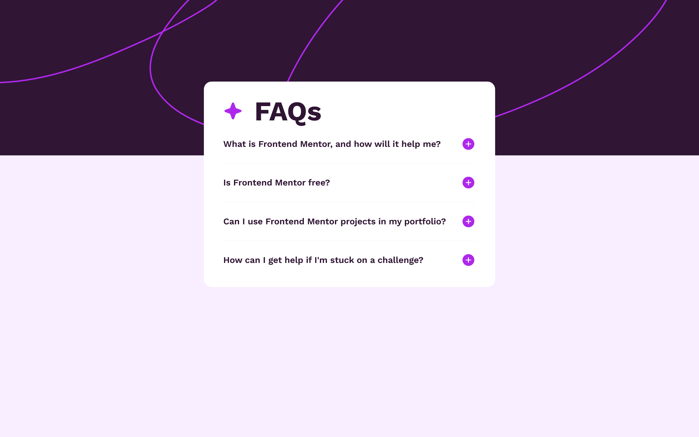

# Frontend Mentor - FAQ accordion solution

This is a solution to the [FAQ accordion challenge on Frontend Mentor](https://www.frontendmentor.io/challenges/faq-accordion-wyfFdeBwBz). Frontend Mentor challenges help you improve your coding skills by building realistic projects.

## Table of contents

- [Overview](#overview)
  - [Screenshot](#screenshot)
  - [Links](#links)
- [My process](#my-process)
  - [Built with](#built-with)
- [Project Setup](#project-setup)

## Overview

I have built the accessible accordion following [W3C guidelines](https://www.w3.org/WAI/ARIA/apg/patterns/accordion/examples/accordion/).I have built the page using Vue. There wasn't any need to use Vue or any other front-end framework, but I have used it because it's the most comfortable tool for me.

### Screenshot Desktop



### Links

- [Solution URL](https://github.com/rmnkk/faq-accordion)
- [Live Site URL](https://rmnkk.github.io/faq-accordion/)

## My process

### Built with

- [Vue](https://vuejs.org/)
- [Vite](https://vitejs.dev/)
- Custom Css Properties [Variables](https://developer.mozilla.org/en-US/docs/Web/CSS/Using_CSS_custom_properties)
- [W3C guidelines](https://www.w3.org/WAI/ARIA/apg/patterns/accordion/examples/accordion/)

## Project setup

If you want to test the project on your own machine

### Instal dependencies

```
pnpm install
```

### Compile and Hot-Reload for Development

```
pnpm dev
```

### Type-Check, Compile and Minify for Production

```
pnpm build
```

### Lint with [ESLint](https://eslint.org/)

```
pnpm lint
```
